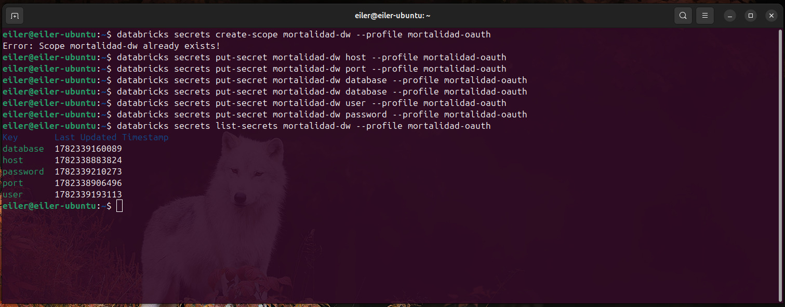

# Clasificación de Exceso de Mortalidad Mundial mediante Regresión Logística

## Nombre del problema

**Clasificación binaria de exceso de mortalidad mundial por país y mes.**

El objetivo del modelo es identificar si una observación mensual de mortalidad de un país presenta **exceso de mortalidad** respecto a una línea base histórica pre-COVID.

El modelo no predice la cantidad exacta de muertes. El modelo clasifica cada observación en una de dos clases:

| Valor | Significado |
|---:|---|
| `0` | No se predice exceso de mortalidad |
| `1` | Sí se predice exceso de mortalidad |

---

## Archivos principales

| Archivo | Descripción |
|---|---|
| `ml_exceso_mortalidad_logistica.ipynb` | Notebook de Databricks utilizado para conectarse al Data Warehouse, consultar mortalidad mundial, construir la variable objetivo, entrenar el modelo, evaluar métricas, exportar el `.tar.gz` y registrar el modelo en MLflow. |
| `modelo_exceso_mortalidad_logreg.tar.gz` | Paquete comprimido con el modelo entrenado y los artefactos necesarios para documentar, evaluar y reutilizar el modelo. |

---

## Evidencias para MkDocs


### Captura: conexión segura al Data Warehouse



El código usado tiene esta estructura:

```python
db_host = dbutils.secrets.get(scope="mortalidad-dw", key="host")
db_port = dbutils.secrets.get(scope="mortalidad-dw", key="port")
db_name = dbutils.secrets.get(scope="mortalidad-dw", key="database")
db_user = dbutils.secrets.get(scope="mortalidad-dw", key="user")
db_password = dbutils.secrets.get(scope="mortalidad-dw", key="password")

jdbc_url = f"jdbc:postgresql://{db_host}:{db_port}/{db_name}"

connection_properties = {
    "user": db_user,
    "password": db_password,
    "driver": "org.postgresql.Driver"
}
```

---

## Fuente de datos

El modelo utiliza datos consolidados en el Data Warehouse.

| Tabla | Uso |
|---|---|
| `dw.fact_mortalidad_mundial` | Tabla de hechos con registros de mortalidad mundial. |
| `dw.dim_tiempo` | Dimensión temporal usada para obtener año y mes. |
| `dw.dim_geografia_mundial` | Dimensión geográfica usada para obtener país, código ISO y región. |

El modelo trabaja a nivel mensual, por lo que el grano del dataset es:

```text
país - año - mes
```

Ejemplo conceptual:

| País | Año | Mes | Muertes observadas |
|---|---:|---:|---:|
| Costa Rica | 2024 | 6 | 2500 |
| Brasil | 2024 | 6 | 120000 |
| Japón | 2024 | 6 | 117000 |

**Limitación importante:** si un país tiene datos semanales o anuales dentro de la fact mundial, puede no entrar a este modelo mensual. Por ejemplo, Guatemala puede existir en la fact mundial como dato semanal, pero no necesariamente entra en este modelo si el filtro trabaja únicamente con meses válidos de 1 a 12.

---

## Construcción de la variable objetivo

Primero se calcula una línea base histórica pre-COVID usando los años **2015 a 2019**.

La línea base se calcula por:

| Campo | Descripción |
|---|---|
| `iso3c` | Código ISO del país. |
| `mes` | Mes del año. |

Ejemplo:

```text
Promedio histórico de Costa Rica en enero = promedio de enero 2015, 2016, 2017, 2018 y 2019.
Promedio histórico de Costa Rica en febrero = promedio de febrero 2015, 2016, 2017, 2018 y 2019.
```

Luego se calcula el porcentaje de exceso:

```text
exceso_pct = (muertes_observadas - promedio_pre_covid) / promedio_pre_covid
```

La variable objetivo se construye con la regla del 15%:

| Condición | Clase |
|---|---:|
| `exceso_pct >= 0.15` | `1` |
| `exceso_pct < 0.15` | `0` |

En otras palabras, si las muertes observadas superan en al menos 15% el promedio histórico pre-COVID del mismo país y mes, la observación se etiqueta como exceso de mortalidad.

---

## Variables usadas por el modelo

| Variable | Tipo | Descripción |
|---|---|---|
| `iso3c` | Categórica | Código ISO del país. |
| `region` | Categórica | Región geográfica del país. |
| `anio` | Numérica | Año de la observación. |
| `mes` | Numérica | Mes de la observación. |
| `promedio_pre_covid` | Numérica | Promedio histórico pre-COVID del país y mes. |
| `desviacion_pre_covid` | Numérica | Desviación histórica pre-COVID del país y mes. |

La variable objetivo es:

| Variable | Descripción |
|---|---|
| `exceso_mortalidad` | Clase binaria: `0` = no exceso, `1` = exceso. |

---

## Funcionamiento general del notebook

El notebook realiza este flujo:

1. Lee credenciales seguras desde Databricks Secrets.
2. Se conecta al Data Warehouse mediante JDBC usando PySpark.
3. Consulta `dw.fact_mortalidad_mundial` junto con las dimensiones de tiempo y geografía.
4. Agrupa la mortalidad por país, año y mes.
5. Convierte los datos a pandas para el procesamiento de Machine Learning.
6. Calcula la línea base histórica pre-COVID 2015-2019 por país y mes.
7. Calcula el porcentaje de exceso de mortalidad.
8. Crea la variable objetivo `exceso_mortalidad`.
9. Divide los datos en entrenamiento y prueba.
10. Entrena una Regresión Logística con scikit-learn.
11. Evalúa el modelo con métricas de clasificación.
12. Compara distintos umbrales de decisión.
13. Exporta el modelo en un archivo `.tar.gz`.
14. Registra el modelo y artefactos en MLflow.

---

## Modelo utilizado

El modelo utilizado es una **Regresión Logística**, implementada con la librería **scikit-learn** de Python.

En el notebook se utiliza la clase `LogisticRegression` del módulo `sklearn.linear_model`. Esta clase se encarga internamente de entrenar el modelo, aplicar la función sigmoide, optimizar los pesos mediante una función de pérdida logística y aplicar regularización.

La Regresión Logística calcula primero una combinación lineal de las variables:

```text
z = w1*x1 + w2*x2 + ... + b
```

Luego aplica la función sigmoide:

```text
probabilidad = 1 / (1 + e^(-z))
```

La sigmoide transforma el resultado en una probabilidad entre 0 y 1.

Ejemplo:

| Probabilidad | Umbral | Resultado |
|---:|---:|---:|
| 0.30 | 0.50 | 0 |
| 0.82 | 0.50 | 1 |

---

## Configuración técnica del pipeline de scikit-learn

El modelo se entrenó con un `Pipeline` de scikit-learn. Este pipeline une dos etapas:

1. `preprocessor`: transforma las variables categóricas y numéricas.
2. `classifier`: entrena la Regresión Logística.

Estructura usada:

```python
model = Pipeline(
    steps=[
        ("preprocessor", preprocessor),
        ("classifier", LogisticRegression(
            max_iter=1000,
            class_weight="balanced",
            random_state=42
        ))
    ]
)
```

### Preprocesamiento

| Tipo de variable | Columnas | Transformación |
|---|---|---|
| Categóricas | `iso3c`, `region` | `OneHotEncoder(handle_unknown="ignore")` |
| Numéricas | `anio`, `mes`, `promedio_pre_covid`, `desviacion_pre_covid` | `StandardScaler()` |

`OneHotEncoder` convierte categorías como países y regiones en columnas numéricas. `StandardScaler` normaliza las variables numéricas para que el modelo no se vea dominado por variables con escalas más grandes.

### Parámetros configurados explícitamente

| Parámetro | Valor usado | Significado |
|---|---:|---|
| `max_iter` | `1000` | Número máximo de iteraciones permitidas al optimizador. El modelo puede detenerse antes si converge. |
| `class_weight` | `"balanced"` | Ajusta pesos de clase para compensar desbalance entre clase 0 y clase 1. |
| `random_state` | `42` | Permite reproducibilidad en procesos donde exista aleatoriedad. |

### Parámetros usados por defecto

Aunque no se escribieron explícitamente, `LogisticRegression` usa por defecto:

| Parámetro | Valor | Explicación |
|---|---:|---|
| `penalty` | `"l2"` | Aplica regularización L2. Penaliza pesos demasiado grandes. |
| `C` | `1.0` | Inverso de la fuerza de regularización. Menor `C` significa más regularización. |
| `solver` | `"lbfgs"` | Algoritmo de optimización para encontrar los pesos. |
| `fit_intercept` | `True` | Incluye intercepto o bias. |
| `tol` | `1e-4` | Tolerancia usada como criterio de parada. |

La función de pérdida optimizada por la Regresión Logística es **Log Loss** o **entropía cruzada binaria**. En este modelo, esa pérdida se combina con regularización L2.

Para dejarlo explícito en el notebook, puede escribirse así:

```python
model = Pipeline(
    steps=[
        ("preprocessor", preprocessor),
        ("classifier", LogisticRegression(
            penalty="l2",
            C=1.0,
            solver="lbfgs",
            max_iter=1000,
            class_weight="balanced",
            random_state=42
        ))
    ]
)
```

Para verificar los parámetros reales después del entrenamiento:

```python
classifier = model.named_steps["classifier"]

print("Regularización:", classifier.penalty)
print("C:", classifier.C)
print("Solver:", classifier.solver)
print("Máximo de iteraciones:", classifier.max_iter)
print("Iteraciones usadas:", classifier.n_iter_)
print("Class weight:", classifier.class_weight)
```

---

## Archivos incluidos en el `.tar.gz`

El paquete exportado es:

```text
modelo_exceso_mortalidad_logreg.tar.gz
```

Después de agregar la línea base histórica al paquete, el `.tar.gz` debe contener:

| Archivo | Descripción |
|---|---|
| `modelo_logreg.joblib` | Modelo entrenado. Contiene el pipeline completo: preprocesamiento y Regresión Logística. |
| `feature_columns.joblib` | Lista de columnas que el modelo espera recibir para predecir. |
| `baseline_pre_covid.csv` | Línea base histórica pre-COVID 2015-2019 por `iso3c` y `mes`. Permite obtener automáticamente `promedio_pre_covid` y `desviacion_pre_covid`. |
| `metricas_modelo.json` | Métricas finales del modelo, umbral usado, matriz de confusión y configuración resumida. |
| `matriz_confusion.csv` | Matriz de confusión con aciertos y errores del modelo. |
| `comparacion_umbrales.csv` | Resultados de accuracy, precision, recall, F1, falsos positivos y falsos negativos para diferentes umbrales. |
| `coeficientes_modelo.csv` | Pesos aprendidos por la Regresión Logística para cada variable transformada. |
| `README_modelo.txt` | Resumen básico generado durante la exportación. |

**Nota:** este archivo no debe incluir credenciales, contraseñas, tokens ni secrets.

---

## Cómo usar el modelo teniendo el `.tar.gz`

El modelo sí necesita `promedio_pre_covid` y `desviacion_pre_covid`, porque fueron variables usadas durante el entrenamiento. Sin embargo, no es necesario escribir esos valores manualmente si el paquete contiene `baseline_pre_covid.csv`.

El siguiente ejemplo recibe país, región, año y mes. Luego busca automáticamente el promedio y la desviación en `baseline_pre_covid.csv`.

```python
import tarfile
import joblib
import pandas as pd
import json
import os

# 1. Extraer el paquete
# Cambiar esta ruta si el .tar.gz está en otra carpeta
tar_path = "modelo_exceso_mortalidad_logreg.tar.gz"
extract_dir = "modelo_mundial_extraido"

with tarfile.open(tar_path, "r:gz") as tar:
    tar.extractall(extract_dir)

# 2. Cargar artefactos
modelo = joblib.load(os.path.join(extract_dir, "modelo_logreg.joblib"))
feature_columns = joblib.load(os.path.join(extract_dir, "feature_columns.joblib"))
baseline = pd.read_csv(os.path.join(extract_dir, "baseline_pre_covid.csv"))

with open(os.path.join(extract_dir, "metricas_modelo.json"), "r", encoding="utf-8") as f:
    metricas = json.load(f)

# 3. Datos que se desean evaluar
# En este modelo mundial, region sigue siendo una variable de entrada.
# Los valores promedio_pre_covid y desviacion_pre_covid se buscan automáticamente.
iso3c_objetivo = "CRI"
region_objetivo = "Latin America & Caribbean"
anio_objetivo = 2024
mes_objetivo = 6

# 4. Buscar línea base histórica sin escribirla manualmente
fila_baseline = baseline[
    (baseline["iso3c"].astype(str).str.upper() == iso3c_objetivo.upper()) &
    (baseline["mes"].astype(int) == int(mes_objetivo))
]

if fila_baseline.empty:
    raise ValueError("No existe línea base histórica para ese país y mes.")

promedio_pre_covid = fila_baseline["promedio_pre_covid"].iloc[0]
desviacion_pre_covid = fila_baseline["desviacion_pre_covid"].iloc[0]

# 5. Construir registro para el modelo
nuevo_dato = pd.DataFrame([
    {
        "iso3c": iso3c_objetivo,
        "region": region_objetivo,
        "anio": anio_objetivo,
        "mes": mes_objetivo,
        "promedio_pre_covid": promedio_pre_covid,
        "desviacion_pre_covid": desviacion_pre_covid
    }
])

# Ordenar columnas según lo usado en entrenamiento
nuevo_dato = nuevo_dato[feature_columns]

# 6. Predecir
probabilidad = modelo.predict_proba(nuevo_dato)[:, 1][0]
umbral = metricas.get("umbral_decision", 0.50)
prediccion = int(probabilidad >= umbral)

print("País:", iso3c_objetivo)
print("Año:", anio_objetivo)
print("Mes:", mes_objetivo)
print("Promedio pre-COVID usado:", promedio_pre_covid)
print("Desviación pre-COVID usada:", desviacion_pre_covid)
print("Probabilidad de exceso:", probabilidad)
print("Umbral:", umbral)
print("Predicción:", prediccion)
```

Interpretación de la salida:

| Resultado | Significado |
|---:|---|
| `0` | No se predice exceso de mortalidad. |
| `1` | Sí se predice exceso de mortalidad. |

---

## Cómo interpretar las métricas del modelo

El modelo genera métricas de clasificación. Estas métricas se guardan en `metricas_modelo.json`, se muestran en el notebook y también pueden aparecer en `classification_report`.

### Matriz de confusión

La matriz de confusión compara la clase real contra la clase predicha:

| | Predicción 0: no exceso | Predicción 1: exceso |
|---|---:|---:|
| Real 0: no exceso | Verdadero negativo (TN) | Falso positivo (FP) |
| Real 1: exceso | Falso negativo (FN) | Verdadero positivo (TP) |

### Conceptos principales

| Métrica | Fórmula | Significado |
|---|---|---|
| Accuracy | `(TP + TN) / total` | Porcentaje total de predicciones correctas. Puede ser engañoso si hay desbalance de clases. |
| Precision | `TP / (TP + FP)` | De todos los registros que el modelo predijo como exceso, cuántos realmente eran exceso. Mide la confiabilidad de las alertas positivas. |
| Recall | `TP / (TP + FN)` | De todos los registros que realmente tenían exceso, cuántos logró detectar el modelo. También se conoce como sensibilidad. |
| F1-score | `2 * (precision * recall) / (precision + recall)` | Promedio armónico entre precision y recall. Es útil cuando interesa balancear falsos positivos y falsos negativos. |
| Support | Conteo de registros por clase | Cantidad de observaciones reales de cada clase usadas en la evaluación. |

### Falsos positivos y falsos negativos

| Error | Qué significa en este problema | Impacto |
|---|---|---|
| Falso positivo (FP) | El modelo predice exceso de mortalidad, pero realmente no había exceso. | Puede generar una alerta innecesaria o sobreestimación del riesgo. |
| Falso negativo (FN) | El modelo predice que no hay exceso, pero realmente sí había exceso. | Es más delicado porque el modelo no detecta un evento real de exceso de mortalidad. |

En problemas de salud pública, normalmente se busca reducir los **falsos negativos**, porque no detectar un exceso real puede ser más riesgoso que generar una alerta de más. Por eso se revisan distintos umbrales de decisión.

### Umbral de decisión

La Regresión Logística devuelve una probabilidad. El umbral define desde qué probabilidad se clasifica como clase 1.

Ejemplo:

| Probabilidad | Umbral | Predicción |
|---:|---:|---:|
| 0.48 | 0.50 | 0 |
| 0.62 | 0.50 | 1 |
| 0.62 | 0.70 | 0 |

Subir el umbral suele reducir falsos positivos, pero puede aumentar falsos negativos. Bajar el umbral suele detectar más casos reales, pero puede aumentar falsos positivos.

---

## Registro en MLflow

El notebook registra el modelo en MLflow / Databricks Model Registry. En MLflow se guardan:

| Elemento | Descripción |
|---|---|
| Parámetros | Modelo, features, umbral y definición del problema. |
| Métricas | Accuracy, precision, recall y F1-score. |
| Artefactos | Matriz de confusión, comparación de umbrales, coeficientes, README y otros archivos auxiliares. |
| Modelo | Pipeline completo de scikit-learn. |

---

## Seguridad

Las credenciales del DW se leen con Databricks Secrets y no deben escribirse directamente en el notebook ni exportarse dentro del `.tar.gz`.

El paquete exportado debe contener artefactos del modelo, pero no debe contener:

- Contraseñas.
- Usuarios privados.
- Tokens.
- Host sensible si no debe compartirse.
- Secrets de Databricks.

---

## Conclusión

Este modelo permite clasificar exceso de mortalidad mundial a nivel país-mes. Utiliza PySpark para conectarse al Data Warehouse y scikit-learn para entrenar una Regresión Logística con función sigmoide, Log Loss, regularización L2 y pesos balanceados por clase. El paquete `.tar.gz` incluye el modelo, métricas, comparación de umbrales y la línea base histórica necesaria para utilizar el modelo sin ingresar manualmente `promedio_pre_covid` ni `desviacion_pre_covid`.
