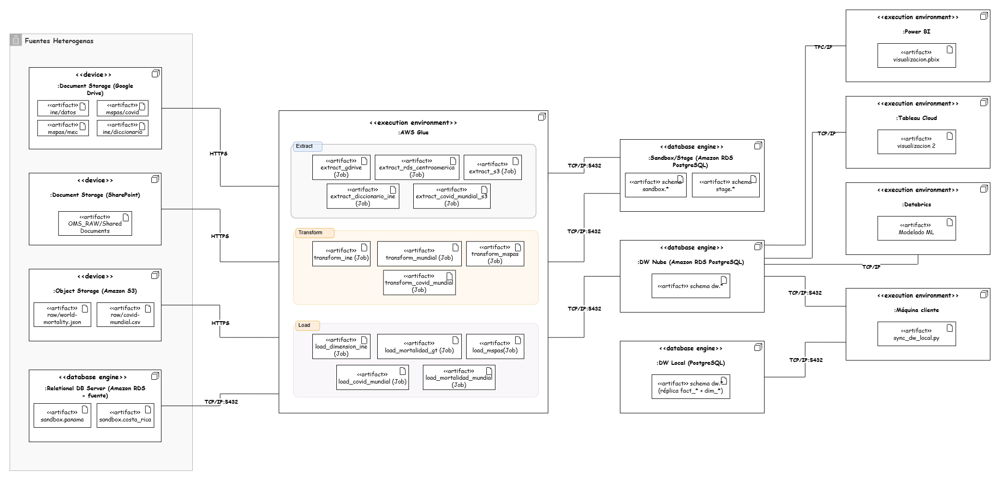

# Diagrama de Despliegue UML

El siguiente diagrama de despliegue detalla la topología de la infraestructura, los entornos de ejecución y los protocolos de comunicación utilizados para el pipeline de datos end-to-end. 

## Componentes de la Arquitectura

La solución se divide en cuatro grandes bloques de procesamiento y almacenamiento:

### 1. Fuentes Heterogéneas (Capa de Extracción)
Los datos de origen residen en múltiples plataformas. La extracción se realiza de forma segura utilizando los protocolos nativos de cada servicio:
*   **Document Storage (Google Drive & SharePoint):** Archivos planos y diccionarios consumidos vía **HTTPS**.
*   **Object Storage (Amazon S3):** Repositorios de datos mundiales (JSON/CSV) consumidos de forma segura vía **HTTPS**.
*   **Relational DB Server (Amazon RDS):** Bases de datos transaccionales de Centroamérica consultadas directamente a través del puerto **TCP/IP:5432**.

### 2. Entorno de Ejecución (AWS Glue)
El núcleo del procesamiento se orquesta en **AWS Glue**, un entorno *Serverless* que ejecuta scripts en Python. La carga de trabajo está modularizada en tres fases lógicas:
*   **Jobs de Extracción (`Extract`):** Tareas dedicadas a la lectura de las fuentes y su ingesta hacia la capa Sandbox.
*   **Jobs de Transformación (`Transform`):** Scripts que aplican las reglas de negocio, limpieza, deduplicación y tipado de datos.
*   **Jobs de Carga (`Load`):** Procesos encargados del Upsert final hacia el Data Warehouse.

### 3. Almacenamiento en la Nube (Amazon RDS PostgreSQL)
Las bases de datos destino están desplegadas en instancias de Amazon RDS, recibiendo la ingesta desde AWS Glue mediante conexiones JDBC/psycopg2 sobre el puerto **TCP/IP:5432**.
*   **Sandbox/Stage:** Esquemas intermedios para datos crudos y pre-procesados.
*   **DW Nube:** Esquema final `dw.*` estructurado en un modelo dimensional (Galaxy Schema).

### 4. Entorno de Ejecución Cliente (Data Warehouse Local)
Una máquina cliente ejecuta el artefacto `sync_dw_local.py`, encargado de extraer la metadata y los registros de la nube e inyectarlos en una instancia local de PostgreSQL, completando la arquitectura híbrida.