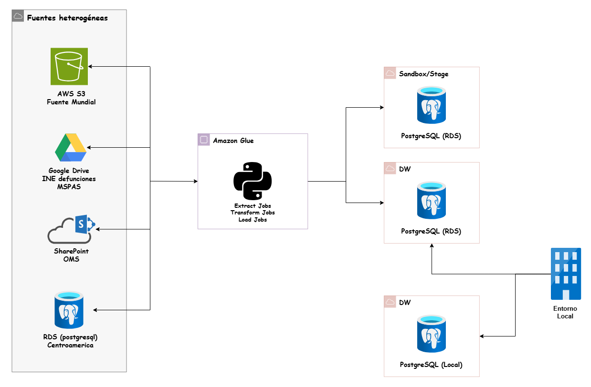

# Arquitectura Híbrida (Nube / Local)

El proyecto implementa un modelo de **Data Warehousing Híbrido**, garantizando que la información procesada esté disponible tanto en un entorno altamente escalable en la nube como en una réplica local para análisis en entornos cerrados o de desarrollo.

## Flujo de Sincronización

La estrategia de interoperabilidad nube-local sigue un patrón de "Nube como Maestro" (*Cloud-Master*). 

1.  **Consolidación en la Nube:** AWS Glue se encarga de todo el procesamiento pesado (ETL/ELT), integrando las fuentes heterogéneas y consolidando la "Única Versión de la Verdad" en la instancia de **Amazon RDS (DW Nube)**.
2.  **Réplica Controlada:** Una vez finalizados los jobs de AWS Glue, el entorno local toma el control de la sincronización. 
3.  **Inyección a Infraestructura Local:** El Data Warehouse local se aloja en una infraestructura local aislada (típicamente un entorno de desarrollo en contenedores). A través de un script de Python automatizado, la máquina extrae la capa analítica de AWS RDS y ejecuta una carga idempotente en la base de datos PostgreSQL local.

## Ventajas del Modelo Implementado

*   **Protección de Recursos Locales:** Al delegar las transformaciones complejas (como la limpieza de nulos y estandarización del CIE-10) a AWS Glue, la computadora local no consume memoria RAM ni CPU en procesos de Big Data.
*   **Idempotencia:** El script de sincronización local utiliza estrategias de truncado en cascada e inserción por bloques (`chunks`), permitiendo que el job se pueda ejecutar múltiples veces sin romper la integridad referencial del esquema local.
*   **Disponibilidad Offline:** Permite a los analistas consumir los tableros de Business Intelligence (BI) conectándose al DW local, reduciendo los costos de transferencia de red hacia AWS.