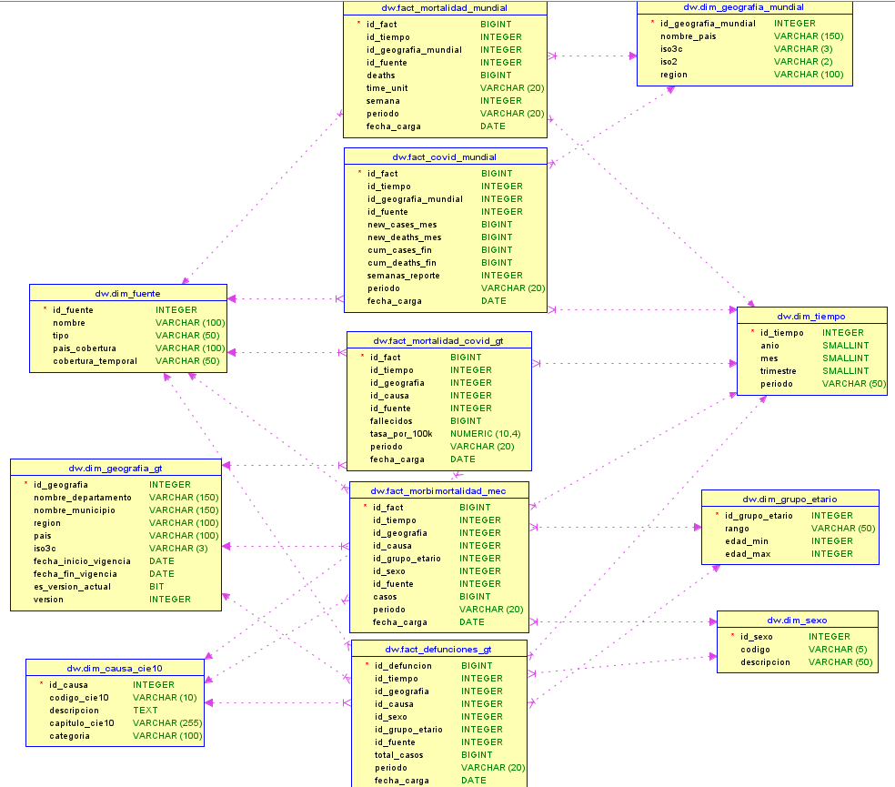

# Diccionario de Datos — Capa Data Warehouse (Oro)

La capa **Data Warehouse (Oro)** contiene el modelo analítico final diseñado bajo un **Esquema de Constelación (Galaxy Schema)**. Las múltiples Tablas de Hechos comparten un conjunto de Dimensiones Conformadas, lo que permite cruzar información de diferentes fuentes (nacionales e internacionales) sin perder consistencia temporal o geográfica.

Se hace uso estricto de **Llaves Subrogadas (Surrogate Keys)** autoincrementales para mantener la independencia con los sistemas transaccionales de origen y optimizar el rendimiento de las consultas OLAP en herramientas de Business Intelligence.

---

## 1. Tablas de Dimensiones (Conformadas)

Las dimensiones almacenan el contexto del negocio (el quién, cuándo, dónde y qué).

### `dim_causa_cie10`
Catálogo estandarizado de la Clasificación Internacional de Enfermedades (CIE-10).

| Columna | Tipo de Dato | Llave | Descripción / Regla de Negocio |
| :--- | :--- | :--- | :--- |
| `id_causa` | `serial` | **PK** | Llave subrogada única para la dimensión causa. |
| `codigo_cie10` | `varchar(10)` | UNIQUE | Código oficial y natural del CIE-10 (ej. U071). |
| `descripcion` | `text` | - | Descripción completa y detallada de la patología. |
| `capitulo_cie10` | `varchar(255)` | - | Agrupación superior o capítulo según el manual CIE-10. |
| `categoria` | `varchar(100)` | - | Categorización simplificada de la enfermedad (ej. Crónica, Infecciosa). |

### `dim_fuente`
Identifica el origen o proveedor de los datos procesados.

| Columna | Tipo de Dato | Llave | Descripción / Regla de Negocio |
| :--- | :--- | :--- | :--- |
| `id_fuente` | `integer` | **PK** | Llave subrogada de la fuente. |
| `nombre` | `varchar(100)` | UNIQUE | Nombre corto de la fuente u organización (ej. INE, MSPAS, OMS). |
| `tipo` | `varchar(50)` | - | Alcance geográfico de la fuente (Nacional, Institucional, Internacional). |
| `pais_cobertura` | `varchar(100)` | - | Territorio o países que abarca la recolección de datos. |
| `cobertura_temporal` | `varchar(50)` | - | Rango de años que contiene el dataset original de esta fuente. |

### `dim_geografia_gt`
Dimensión espacial de Guatemala, preparada para mantener históricos (Slowly Changing Dimension Tipo 2).

| Columna | Tipo de Dato | Llave | Descripción / Regla de Negocio |
| :--- | :--- | :--- | :--- |
| `id_geografia` | `serial` | **PK** | Llave subrogada geográfica para ubicaciones en GT. |
| `nombre_departamento` | `varchar(150)` | UNIQUE* | Nombre del departamento (*Forma llave compuesta con municipio). |
| `nombre_municipio` | `varchar(150)` | UNIQUE* | Nombre del municipio (*Forma llave compuesta con depto). |
| `region` | `varchar(100)` | - | Región del país (Constante a "Guatemala" en este esquema). |
| `pais` | `varchar(100)` | - | Nombre del país (Guatemala). |
| `iso3c` | `varchar(3)` | - | Código ISO-3166-1 alpha-3 del país (GTM). |
| `fecha_inicio_vigencia` | `date` | - | SCD Tipo 2: Fecha en la que la división política comenzó a ser válida. |
| `fecha_fin_vigencia` | `date` | - | SCD Tipo 2: Fecha en la que cambió el registro (Null = Actual). |
| `es_version_actual` | `boolean` | - | Bandera para identificar rápidamente el registro geográfico vigente. |
| `version` | `integer` | - | Número de versión de este registro espacial. |

### `dim_geografia_mundial`
Dimensión espacial para la analítica internacional y continental.

| Columna | Tipo de Dato | Llave | Descripción / Regla de Negocio |
| :--- | :--- | :--- | :--- |
| `id_geografia_mundial` | `serial` | **PK** | Llave subrogada geográfica global. |
| `nombre_pais` | `varchar(150)` | - | Nombre estandarizado del país. |
| `iso3c` | `varchar(3)` | UNIQUE | Código ISO de 3 letras único por país. |
| `iso2` | `varchar(2)` | - | Código ISO de 2 letras. |
| `region` | `varchar(100)` | - | Continente o macro-región asignada. |

### `dim_grupo_etario`
Catálogo estático para clasificar las edades de los pacientes o fallecidos en rangos analíticos.

| Columna | Tipo de Dato | Llave | Descripción / Regla de Negocio |
| :--- | :--- | :--- | :--- |
| `id_grupo_etario` | `integer` | **PK** | Llave subrogada del grupo etario. |
| `rango` | `varchar(50)` | UNIQUE | Etiqueta descriptiva del rango de edad (ej. 15-29, 60 o más). |
| `edad_min` | `integer` | - | Límite inferior numérico para el rango. |
| `edad_max` | `integer` | - | Límite superior numérico para el rango. |

### `dim_sexo`
Catálogo estático de los géneros biológicos documentados.

| Columna | Tipo de Dato | Llave | Descripción / Regla de Negocio |
| :--- | :--- | :--- | :--- |
| `id_sexo` | `integer` | **PK** | Llave subrogada del género. |
| `codigo` | `varchar(5)` | UNIQUE | Código corto identificador (M, F, N). |
| `descripcion` | `varchar(50)` | - | Descripción completa (Masculino, Femenino, No especificado). |

### `dim_tiempo`
Dimensión temporal a nivel de Mes/Año.

| Columna | Tipo de Dato | Llave | Descripción / Regla de Negocio |
| :--- | :--- | :--- | :--- |
| `id_tiempo` | `serial` | **PK** | Llave subrogada temporal. |
| `anio` | `smallint` | UNIQUE* | Año calendario (*Forma llave compuesta con mes). |
| `mes` | `smallint` | UNIQUE* | Mes calendario. Si es 0, representa un acumulado o métrica anual. |
| `trimestre` | `smallint` | - | Trimestre calculado a partir del mes (1 al 4). |
| `periodo` | `varchar(50)` | - | Clasificación del análisis principal (pre-COVID, COVID, post-COVID). |

---

## 2. Tablas de Hechos (Facts)

Las tablas de hechos almacenan las métricas cuantitativas (casos, defunciones, tasas) apuntando a sus respectivas dimensiones a través de llaves foráneas.

### `fact_defunciones_gt`
Mortalidad general a nivel nacional con alta granularidad demográfica (INE).

| Columna | Tipo de Dato | Llave | Descripción / Regla de Negocio |
| :--- | :--- | :--- | :--- |
| `id_defuncion` | `bigserial` | **PK** | Llave primaria de la tabla de hechos. |
| `id_tiempo` | `integer` | **FK** | Referencia a `dim_tiempo`. |
| `id_geografia` | `integer` | **FK** | Referencia a `dim_geografia_gt`. |
| `id_causa` | `integer` | **FK** | Referencia a `dim_causa_cie10`. |
| `id_sexo` | `integer` | **FK** | Referencia a `dim_sexo`. |
| `id_grupo_etario` | `integer` | **FK** | Referencia a `dim_grupo_etario`. |
| `id_fuente` | `integer` | **FK** | Referencia a `dim_fuente`. |
| `total_casos` | `bigint` | **Métrica** | Cantidad de decesos registrados para ese cruce dimensional. |
| `periodo` | `varchar(20)` | - | Contexto de validación rápida. |
| `fecha_carga` | `varchar(30)` | - | Auditoría: Fecha de inyección en AWS Glue. |

### `fact_morbimortalidad_mec`
Casos crónicos y mortalidad reportada por los hospitales nacionales (MSPAS MEC).

| Columna | Tipo de Dato | Llave | Descripción / Regla de Negocio |
| :--- | :--- | :--- | :--- |
| `id_fact` | `bigserial` | **PK** | Llave primaria de la tabla de hechos. |
| `id_tiempo` | `integer` | **FK** | Referencia a `dim_tiempo`. |
| `id_geografia` | `integer` | **FK** | Referencia a `dim_geografia_gt`. |
| `id_causa` | `integer` | **FK** | Referencia a `dim_causa_cie10`. |
| `id_grupo_etario` | `integer` | **FK** | Referencia a `dim_grupo_etario`. |
| `id_sexo` | `integer` | **FK** | Referencia a `dim_sexo`. |
| `id_fuente` | `integer` | **FK** | Referencia a `dim_fuente`. |
| `casos` | `bigint` | **Métrica** | Cantidad reportada de eventos (morbilidad o decesos crónicos). |
| `periodo` | `varchar(20)` | - | Contexto de validación rápida. |
| `fecha_carga` | `varchar(30)` | - | Auditoría: Fecha de inyección en AWS Glue. |

### `fact_mortalidad_covid_gt`
Hechos analíticos sobre la mortalidad de la pandemia en Guatemala, incluyendo tasas poblacionales.

| Columna | Tipo de Dato | Llave | Descripción / Regla de Negocio |
| :--- | :--- | :--- | :--- |
| `id_fact` | `bigserial` | **PK** | Llave primaria de la tabla de hechos. |
| `id_tiempo` | `integer` | **FK** | Referencia a `dim_tiempo`. |
| `id_geografia` | `integer` | **FK** | Referencia a `dim_geografia_gt`. |
| `id_causa` | `integer` | **FK** | Referencia a `dim_causa_cie10` (Generalmente U071). |
| `id_fuente` | `integer` | **FK** | Referencia a `dim_fuente`. |
| `fallecidos` | `bigint` | **Métrica** | Cantidad de fallecidos reportados en ese mes/municipio. |
| `tasa_por_100k` | `numeric(10,4)` | **Métrica** | Tasa de decesos estandarizada por cada 100,000 habitantes. |
| `periodo` | `varchar(20)` | - | Contexto de validación rápida. |
| `fecha_carga` | `varchar(30)` | - | Auditoría: Fecha de inyección en AWS Glue. |

### `fact_covid_mundial`
Registro de casos y muertes por COVID-19 en el mundo (OMS).

| Columna | Tipo de Dato | Llave | Descripción / Regla de Negocio |
| :--- | :--- | :--- | :--- |
| `id_fact` | `bigserial` | **PK** | Llave primaria de la tabla de hechos. |
| `id_tiempo` | `integer` | **FK** | Referencia a `dim_tiempo`. |
| `id_geografia_mundial` | `integer`| **FK** | Referencia a `dim_geografia_mundial`. |
| `id_fuente` | `integer` | **FK** | Referencia a `dim_fuente`. |
| `new_cases_mes` | `bigint` | **Métrica** | Suma consolidada de nuevos casos identificados en el mes. |
| `new_deaths_mes` | `bigint` | **Métrica** | Suma consolidada de fallecidos confirmados en el mes. |
| `cum_cases_fin` | `bigint` | **Métrica** | Casos acumulados totales hasta el final de dicho mes. |
| `cum_deaths_fin` | `bigint` | **Métrica** | Fallecidos acumulados totales hasta el final de dicho mes. |
| `semanas_reporte` | `integer` | - | Integridad de calidad: Número de reportes semanales sumados. |
| `periodo` | `varchar(20)` | - | Contexto de validación rápida. |
| `fecha_carga` | `varchar(30)` | - | Auditoría: Fecha de inyección en AWS Glue. |

### `fact_mortalidad_mundial`
Mortalidad de todas las causas global para comparativas base (World Mortality Dataset).

| Columna | Tipo de Dato | Llave | Descripción / Regla de Negocio |
| :--- | :--- | :--- | :--- |
| `id_fact` | `bigserial` | **PK** | Llave primaria de la tabla de hechos. |
| `id_tiempo` | `integer` | **FK** | Referencia a `dim_tiempo`. |
| `id_geografia_mundial` | `integer`| **FK** | Referencia a `dim_geografia_mundial`. |
| `id_fuente` | `integer` | **FK** | Referencia a `dim_fuente`. |
| `deaths` | `bigint` | **Métrica** | Total de fallecimientos reportados. |
| `time_unit` | `varchar(20)` | - | Nivel de agregación con el que se reportó (semanal, anual). |
| `semana` | `integer` | - | Semana del reporte original (nulo si es acumulado anual/mensual). |
| `periodo` | `varchar(20)` | - | Contexto de validación rápida. |
| `fecha_carga` | `varchar(30)` | - | Auditoría: Fecha de inyección en AWS Glue. |

## Modelo Relacional del Data Warehouse

Este es el diagrama relacional diseñado para el Data Warehouse:

### Arquitectura del Modelo: Esquema de Constelación (Galaxia)

A diferencia de un enfoque tradicional de Data Warehouse que utiliza un único "Esquema Estrella" aislado, este sistema implementa un **Esquema de Estrella con Dimensines Conformes**. 

Esta arquitectura se caracteriza por la coexistencia de **múltiples tablas de hechos** que intersectan y comparten un conjunto de **dimensiones conformes**. En lugar de duplicar catálogos o aislar la información por procedencia (INE, MSPAS, OMS), el modelo unifica el contexto analítico permitiendo realizar análisis cruzados entre diferentes fuentes de datos con total consistencia.

#### 1. Tablas de Hechos (Fact Tables)
Ubicadas en el núcleo del modelo, actúan como los contenedores cuantitativos del DW. Almacenan las métricas, contadores numéricos y las claves foráneas (FK) que apuntan hacia las dimensiones. En este diseño encontramos:
* **`fact_mortalidad_ine`**: Captura el volumen masivo de defunciones del registro civil de Guatemala.
* **`fact_mortalidad_mspas_mec`**: Monitorea los casos y decesos por Enfermedades Crónicas recopilados por Salud Pública.
* **`fact_mortalidad_covid_gt`**: Concentra la métrica epidemiológica y tasas de impacto directo de la pandemia a nivel municipal.
* **`fact_mortalidad_mundial` & `fact_mortalidad_centroamerica`**: Proveen el contexto macro y la perspectiva comparativa global.

#### 2. Dimensiones Conformes (Shared Dimensions)
Son los catálogos maestros que le dan contexto al "quién, cuándo, dónde y por qué" de los eventos de mortalidad. Al ser compartidas por varias tablas de hechos, garantizan la integridad referencial y uniformidad de los datos:

* **Dimensión Tiempo (`dim_tiempo`)**: Estructura de grano temporal (año, mes, periodo) que permite alinear cronológicamente las muertes del INE con las olas epidemiológicas del MSPAS o los reportes mundiales bajo una misma línea temporal.
* **Dimensión Geografía (`dim_geografia` y `dim_geografia_mundial`)**: Estandariza las divisiones político-administrativas (departamentos y municipios para Guatemala; países y regiones OMS para el entorno internacional), posibilitando la normalización de tasas geográficas.
* **Dimensión Causa CIE-10 (`dim_causa_cie10`)**: Actúa como el diccionario médico común bajo el estándar internacional de la OMS, amarrando los diagnósticos de crónicas del MSPAS con las causas de defunción codificadas del INE.
* **Dimensión Demografía (`dim_demografia`)**: Desagrega las métricas según características biológicas y de ciclo de vida (sexo, grupos etarios).

