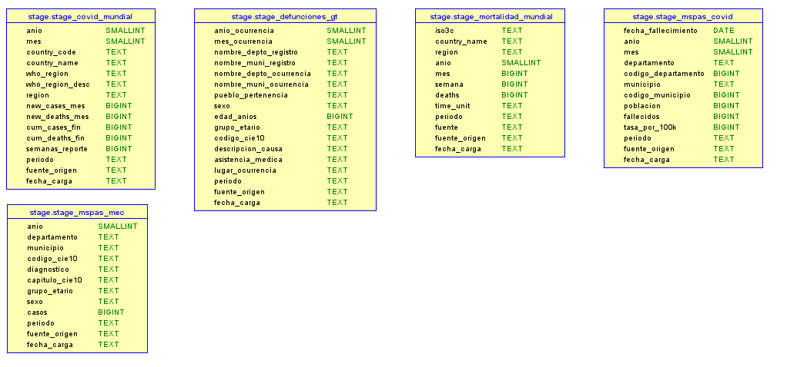

# Diccionario de Datos — Capa Stage

La capa **Stage (Plata)** almacena los datos pre-procesados provenientes del Sandbox. En esta capa se han aplicado reglas de calidad, limpieza de nulos, estandarización de tipos de datos, traducciones y generación de métricas intermedias (agrupaciones temporales, tasas por 100k) antes de su ingesta hacia el Data Warehouse.

A continuación, se detalla la estructura de las cinco tablas principales que componen este esquema.

### 1. Tabla: `stage_covid_mundial`
Contiene la data agregada de forma mensual sobre los casos y muertes por COVID-19 a nivel global (basado en los reportes originales semanales de la OMS).

| Columna | Tipo de Dato | Descripción / Regla de Negocio |
| :--- | :--- | :--- |
| `anio` | `smallint` | Año extraído de la fecha de reporte. |
| `mes` | `smallint` | Mes extraído de la fecha de reporte. |
| `country_code` | `text` | Código ISO2 del país. |
| `country_name` | `text` | Nombre del país estandarizado. |
| `who_region` | `text` | Acrónimo de la región según la OMS (ej. AMRO, EURO). |
| `who_region_desc` | `text` | Nombre legible de la región de la OMS. |
| `region` | `text` | Continente al que pertenece el país. |
| `new_cases_mes` | `double precision` | Suma total de casos nuevos registrados en el mes. |
| `new_deaths_mes` | `double precision` | Suma total de muertes registradas en el mes. |
| `cum_cases_fin` | `bigint` | Último valor de casos acumulados registrado al cierre del mes. |
| `cum_deaths_fin` | `bigint` | Último valor de muertes acumuladas registrado al cierre del mes. |
| `semanas_reporte` | `bigint` | Conteo de cuántas semanas aportaron datos a ese mes. |
| `periodo` | `text` | Clasificación temporal: pre-COVID, COVID, post-COVID. |
| `fuente_origen` | `text` | Identificador constante del job de origen. |
| `fecha_carga` | `text` | Timestamp del momento en que se procesó el registro en Glue. |

---

### 2. Tabla: `stage_defunciones_gt`
Almacena el registro nacional de defunciones de Guatemala proveniente del INE, estandarizado y limpiado.

| Columna | Tipo de Dato | Descripción / Regla de Negocio |
| :--- | :--- | :--- |
| `anio_ocurrencia` | `smallint` | Año en el que ocurrió el deceso. |
| `mes_ocurrencia` | `smallint` | Mes en el que ocurrió el deceso. |
| `nombre_depto_registro` | `text` | Departamento donde se registró administrativamente la defunción. |
| `nombre_muni_registro` | `text` | Municipio donde se registró administrativamente la defunción. |
| `nombre_depto_ocurrencia` | `text` | Departamento donde ocurrió físicamente la defunción. |
| `nombre_muni_ocurrencia` | `text` | Municipio donde ocurrió físicamente la defunción. |
| `pueblo_pertenencia` | `text` | Identidad étnica de la persona. |
| `sexo` | `text` | Género estandarizado (ej. Masculino, Femenino). |
| `edad_anios` | `double precision` | Edad de la persona calculada en años enteros. |
| `grupo_etario` | `text` | Rango de edad normalizado según catálogo definido. |
| `codigo_cie10` | `text` | Código estandarizado de la causa de muerte. |
| `descripcion_causa` | `text` | Descripción textual de la causa de muerte. |
| `asistencia_medica` | `text` | Indica si la persona recibió asistencia médica antes de fallecer. |
| `lugar_ocurrencia` | `text` | Tipo de lugar donde ocurrió el deceso (Hospital, Domicilio, etc.). |
| `periodo` | `text` | Clasificación temporal: pre-COVID, COVID, post-COVID. |
| `fuente_origen` | `text` | Identificador constante del job de origen. |
| `fecha_carga` | `text` | Timestamp de ejecución del ETL. |

---

### 3. Tabla: `stage_mortalidad_mundial`
Contiene la evolución de la mortalidad por todas las causas a nivel global, estandarizando la granularidad temporal (mensual/anual).

| Columna | Tipo de Dato | Descripción / Regla de Negocio |
| :--- | :--- | :--- |
| `iso3c` | `text` | Código ISO3 único del país. |
| `country_name` | `text` | Nombre del país. |
| `region` | `text` | Región o continente asignado. |
| `anio` | `smallint` | Año del registro. |
| `mes` | `double precision` | Mes del registro (nulo si la métrica es anual). |
| `semana` | `double precision` | Semana epidemiológica (si aplica). |
| `deaths` | `double precision` | Cantidad total de muertes reportadas. |
| `time_unit` | `text` | Nivel de agregación del registro (weekly, monthly, annual). |
| `periodo` | `text` | Clasificación temporal: pre-COVID, COVID, post-COVID. |
| `fuente` | `text` | Fuente original de los datos para el país específico. |
| `fuente_origen` | `text` | Identificador constante del job de origen. |
| `fecha_carga` | `text` | Timestamp de ejecución del ETL. |

---

### 4. Tabla: `stage_mspas_covid`
Registro detallado de fallecidos exclusivamente por COVID-19 en Guatemala, incluyendo cálculos demográficos.

| Columna | Tipo de Dato | Descripción / Regla de Negocio |
| :--- | :--- | :--- |
| `fecha_fallecimiento` | `date` | Fecha exacta del deceso tipada correctamente. |
| `anio` | `smallint` | Año extraído de la fecha. |
| `mes` | `smallint` | Mes extraído de la fecha. |
| `departamento` | `text` | Nombre del departamento en Guatemala. |
| `codigo_departamento` | `bigint` | Código numérico oficial del departamento. |
| `municipio` | `text` | Nombre del municipio en Guatemala. |
| `codigo_municipio` | `bigint` | Código numérico oficial del municipio. |
| `poblacion` | `bigint` | Población proyectada del municipio para cálculos estadísticos. |
| `fallecidos` | `bigint` | Conteo de muertes por COVID-19. |
| `tasa_por_100k` | `double precision` | Tasa de mortalidad calculada (fallecidos / población * 100,000). |
| `periodo` | `text` | Clasificación temporal constante (generalmente COVID/post-COVID). |
| `fuente_origen` | `text` | Identificador constante del job de origen. |
| `fecha_carga` | `text` | Timestamp de ejecución del ETL. |

---

### 5. Tabla: `stage_mspas_mec`
Datos consolidados de Morbilidad y Mortalidad de Enfermedades Crónicas en Guatemala.

| Columna | Tipo de Dato | Descripción / Regla de Negocio |
| :--- | :--- | :--- |
| `anio` | `smallint` | Año de consolidación de los casos. |
| `departamento` | `text` | Departamento donde se registraron los casos. |
| `municipio` | `text` | Municipio donde se registraron los casos. |
| `codigo_cie10` | `text` | Código CIE-10 principal del diagnóstico. |
| `diagnostico` | `text` | Descripción médica del diagnóstico. |
| `capitulo_cie10` | `text` | Categorización macro según el manual CIE-10. |
| `grupo_etario` | `text` | Rango de edad de los pacientes afectados. |
| `sexo` | `text` | Género estandarizado de los pacientes. |
| `casos` | `bigint` | Cantidad total de casos (morbilidad o mortalidad) reportados. |
| `periodo` | `text` | Clasificación temporal: pre-COVID, COVID, post-COVID. |
| `fuente_origen` | `text` | Identificador constante del job de origen. |
| `fecha_carga` | `text` | Timestamp de ejecución del ETL. |

## Diagrama de Entidad-Relación (Stage)

Aquí se presenta la estructura gráfica de las tablas en la etapa de Stage:

