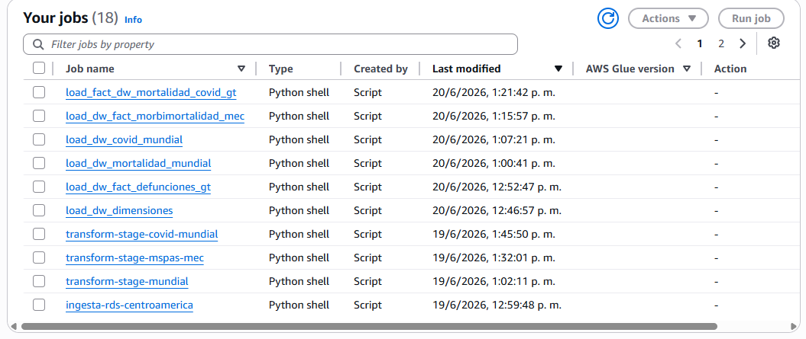

# AWS Glue (Jobs ETL/ELT)

Para la orquestación y procesamiento de datos del proyecto, se seleccionó **AWS Glue** como el motor principal de ETL/ELT. Al ser un servicio completamente administrado (*Serverless*), elimina la necesidad de gestionar infraestructura, servidores o agentes de ejecución externos (cumpliendo con la directiva de diseño de evitar el uso de GitLab o GitHub Runners para tareas pesadas de Big Data).

## Configuración del Entorno de Ejecución

Cada Job dentro de AWS Glue está configurado bajo los siguientes parámetros técnicos de reproducibilidad:

* **Tipo de Job:** Python Shell 
* **Versión de Python:** Python 3.9 / 3.10.
* **Parámetros Dinámicos (`Job Parameters`):** Las cadenas de conexión se inyectan en tiempo de ejecución utilizando `getResolvedOptions`, evitando dejar credenciales en duro en el repositorio de código.
    * `--SANDBOX_DB_URL`: Endpoint seguro del Sandbox en AWS RDS.
    * `--DW_DB_URL`: Endpoint seguro del Data Warehouse en AWS RDS.

## Modularización del Pipeline

El pipeline de transformación no es un script monolítico, sino que está dividido en fases lógicas para garantizar que si un paso falla, el estado intermedio se preserve en la base de datos:

1.  **Fase de Extracción (Extract):** Descarga los archivos crudos de fuentes heterogéneas (S3, Google Drive, SharePoint, RDS origen) y los deposita sin alteraciones en el esquema `sandbox`.
2.  **Fase de Transformación (Transform):** Lee del `sandbox`, aplica tipos de datos correctos, limpia nulos, procesa catálogos médicos y demográficos, y consolida los datos limpios en el esquema `stage`.
3.  **Fase de Carga (Load):** Toma la data del `stage`, calcula las relaciones lógicas y realiza la inserción analítica en las tablas de dimensiones y hechos del esquema `dw`.

---

## Evidencias de Configuración en la Nube

A continuación, se presenta la configuración de los Jobs directamente desde la consola de administración de AWS:

*Fotografía 1: Listado de Jobs funcionales y desplegados en AWS Glue Studio.*