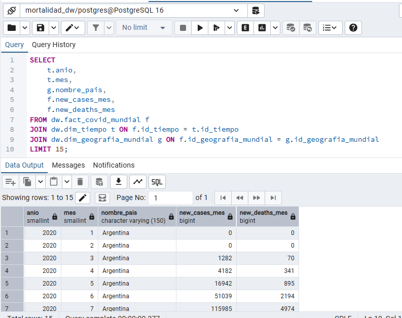

# Réplica y Backup del Data Warehouse (Local)

Para cumplir con las exigencias de una arquitectura híbrida y asegurar la disponibilidad de los datos analíticos de forma local, se diseñó un mecanismo de réplica automatizada desde el entorno de la nube hacia la infraestructura local.

## Estrategia de Réplica Local (`sync_cloud_to_local.py`)

La réplica se ejecuta desde la máquina cliente local mediante un script optimizado de Python que interactúa directamente con los dos extremos de la arquitectura (Nube y Local).

El flujo de sincronización consta de las siguientes fases críticas:

1. **Vaciado en Cascada Inteligente:** Se ejecuta un `TRUNCATE TABLE ... RESTART IDENTITY CASCADE` sobre las tablas locales. El uso de `CASCADE` es obligatorio para que PostgreSQL permita limpiar las dimensiones vaciando automáticamente las tablas de hechos vinculadas, respetando así la integridad referencial y las llaves foráneas.
2. **Extracción por Bloques (*Chunking*):** Para proteger la memoria RAM del entorno local frente a millones de registros (como los de defunciones del INE), la extracción desde AWS RDS se realiza en lotes de **50,000 filas** utilizando el parámetro `chunksize` de la librería Pandas.
3. **Preservación de IDs Subrogados:** Al usar un método de inserción secuencial estrictamente ordenado (insertando las Dimensiones primero y los Hechos después), la base de datos local hereda exactamente los mismos IDs generados en la nube. Esto garantiza que los tableros de Power BI locales funcionen de forma idéntica a los de la nube sin romper las relaciones.

## Evidencias del Entorno Híbrido Local

La correcta implementación de la política de backup e interoperabilidad se evidencia a través de la configuración del orquestador local y la persistencia de los datos en el motor relacional de destino.

*Fotografía 1: Consulta SQL en el cliente de base de datos local demostrando la existencia de los esquemas, las tablas del Data Warehouse y la inyección exitosa de la réplica proveniente de la nube.*