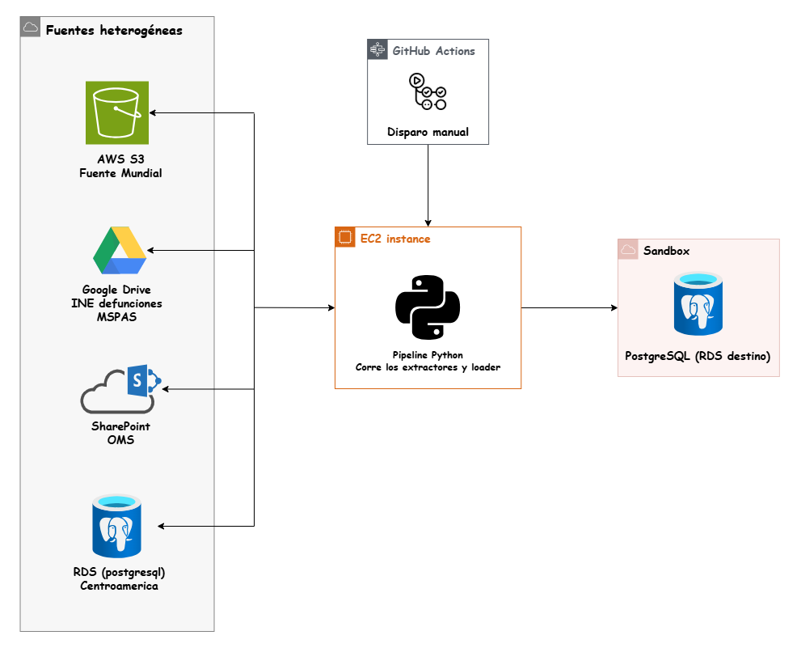
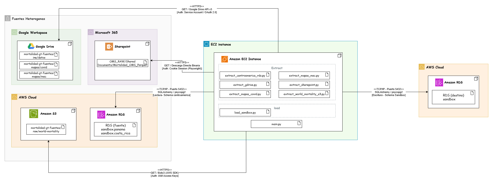

# Arquitectura de la Solución

La plataforma analítica está diseñada bajo un enfoque de extracción centralizada, donde múltiples fuentes heterogéneas convergen en un único entorno de procesamiento antes de aterrizar en la capa de datos (Sandbox).

## Diagrama de Arquitectura Lógica

Este diagrama representa el **flujo de datos de alto nivel** y la orquestación del sistema. Los componentes principales son:

* **Fuentes Heterogéneas:** Representan el origen de los datos crudos, distribuidos en distintos ecosistemas físicos y en la nube (AWS, Google, Microsoft).
* **Orquestador (GitHub Actions):** Actúa como el disparador del proceso, permitiendo ejecuciones manuales o automatizadas del pipeline directamente sobre el servidor.
* **Motor de Procesamiento (Instancia EC2):** El núcleo de la solución. Ejecuta el código en Python, encargado de conectarse a las fuentes, extraer la información temporalmente en memoria, estandarizarla e inyectarle trazabilidad.
* **Destino (Sandbox RDS):** Base de datos relacional PostgreSQL que consolida y almacena los datos extraídos, sirviendo como la única fuente de verdad para las siguientes fases de transformación (Stage/Data Warehouse).

---

## Diagrama de Despliegue (UML)

A nivel de infraestructura, el diagrama de despliegue detalla **dónde residen los componentes de software** y **cómo se comunican** a través de la red.

### Nodos y Fronteras de Red
* **Ecosistemas Externos (SaaS):** Google Workspace (Drive) y Microsoft 365 (SharePoint). Se comunican con la instancia a través de internet público.
* **AWS Cloud (Infraestructura Central):** Contiene tanto los orígenes internos (S3 y una base de datos RDS regional) como el entorno de cómputo (EC2) y el destino final (RDS Sandbox).

### Artefactos de Software
Dentro del nodo de cómputo (Amazon EC2) se despliegan los componentes del código fuente de Python, organizados en módulos independientes:
* **Extractores:** Scripts especializados por fuente (`extract_*.py`).
* **Cargador:** Módulo centralizado de escritura (`load_sandbox.py`).
* **Punto de entrada:** Orquestador local del ciclo de vida (`main.py`).

### Protocolos y Seguridad
Las conexiones entre nodos establecen los siguientes contratos de red y métodos de autenticación:
* **Tráfico Web (HTTPS):** Utilizado para interactuar de forma segura con las APIs de Google Drive (vía OAuth 2.0 con *Service Account*), Boto3 para S3 (vía *IAM Access Keys*) y descargas binarias directas desde SharePoint (vía inyección de *Session Cookies* obtenidas con Playwright).
* **Tráfico de Base de Datos (TCP/IP - Puerto 5432):** Utilizado bidireccionalmente para leer desde la RDS fuente y para la escritura masiva en el schema `sandbox` utilizando SQLAlchemy y el driver `psycopg2` mediante credenciales directas.

---
## Evidencia de los diagramas en Draw.io (Enlace a los archivos .drawio)
- [Diagramas](https://drive.google.com/file/d/1R5IE2yAXDOL0oZvJ872xJeMLZ8hGcO_6/view?usp=sharing)
