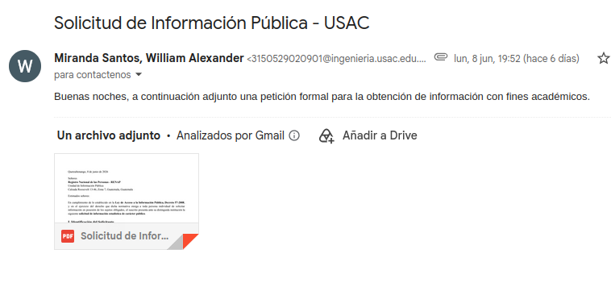
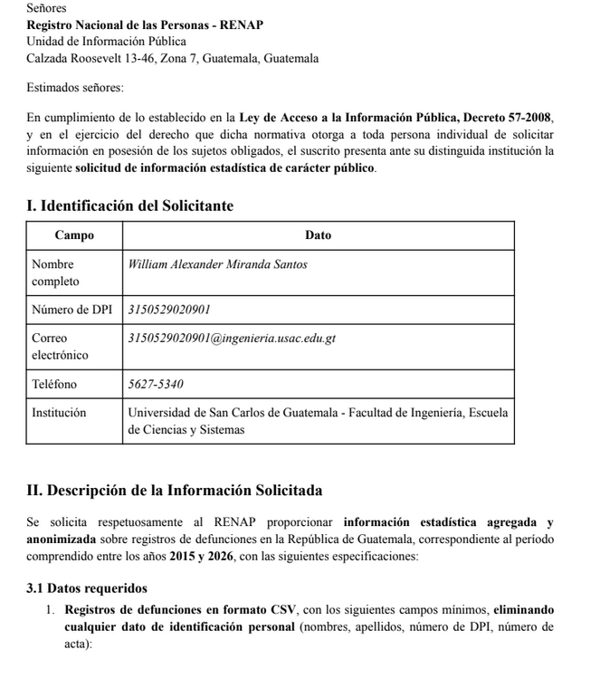
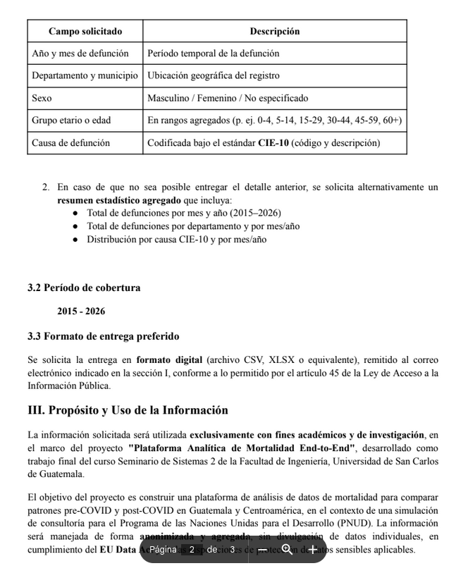
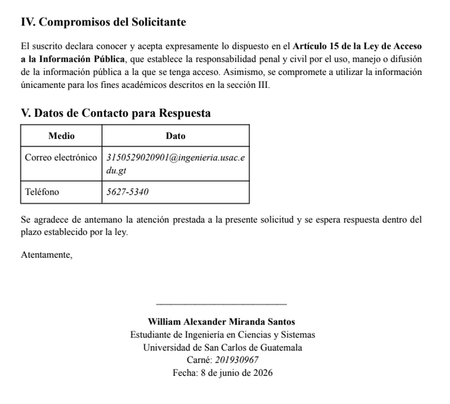

# Evidencia de Solicitud de Información Pública — RENAP

El acceso a estadísticas confiables sobre la mortalidad civil en Guatemala es un pilar fundamental para garantizar el linaje de datos y la transparencia del análisis pre y post-COVID-19. Ante la ausencia de respuesta por parte de las autoridades competentes, este documento constituye la justificación técnica, el fundamento legal y la bitácora de evidencia del proceso de adquisición de datos iniciado de forma externa.

!!! warning "Estado de la Solicitud"
    A la presente fecha, **no se ha recibido respuesta alguna** por parte de la Unidad de Información Pública del Registro Nacional de las Personas (RENAP). Se procede a documentar la gestión formal para dejar constancia de auditoría dentro del marco de la Fase 1 del pipeline.

---

## Justificación Técnica del Requerimiento

Para la construcción de la plataforma analítica del proyecto en el contexto de la simulación para el Programa de las Naciones Unidas para el Desarrollo (PNUD), es indispensable contar con el universo completo de defunciones del país[cite: 10]. 

Aunque el pipeline cuenta actualmente con ingestas del Instituto Nacional de Estadística (INE), la confrontación y validación cruzada con el registro matriz del RENAP permite:
* Mitigar el subregistro o desfase temporal inherente a las publicaciones anuales consolidadas.
* Evaluar la consistencia demográfica interna de las variables de sexo, edad y ubicación geográfica de los decesos ocurridos entre **2015 y 2026**[cite: 10].
* Disponer de una base de contingencia granular para auditorías de datos.

---

## Metadatos de la Gestión Formal

La solicitud se apegó de manera estricta a los canales institucionales vigentes, registrando las siguientes características del trámite[cite: 10]:

| Campo | Detalle |
|---|---|
| **Sujeto Obligado** | Registro Nacional de las Personas (RENAP) — Unidad de Información Pública[cite: 10] |
| **Fundamento Legal** | Ley de Acceso a la Información Pública (Decreto Número 57-2008)[cite: 10] |
| **Solicitante** | William Alexander Miranda Santos (Estudiante de Ingeniería en Ciencias y Sistemas)[cite: 10] |
| **Institución Académica** | Universidad de San Carlos de Guatemala (USAC) — CUNOC[cite: 10] |
| **Fecha de Presentación** | 8 de junio de 2026[cite: 10] |
| **Período de Datos Solicitado** | 2015 a 2026 (Formatos `.csv` agregados y anonimizados)[cite: 10] |
| **Fines de la Información** | Estrictamente académicos y de investigación para el curso Seminario de Sistemas 2[cite: 10] |

---

## Compromisos de Protección de Datos

En observancia de los estándares internacionales de confidencialidad y el marco regulatorio del *EU Data Act*, la solicitud exigió explícitamente la exclusión de cualquier dato de identificación personal (como nombres, apellidos, números de DPI o direcciones específicas)[cite: 10]. El diseño metodológico se estructuró para procesar únicamente variables estadísticas de agregación poblacional[cite: 10].

---

## Evidencias del Proceso de Solicitud

A continuación, se adjuntan las evidencias gráficas obligatorias que respaldan el envío formal del expediente técnico de la solicitud, tanto por los canales digitales como por la correspondencia física de la carta de mérito.

### 1. Captura de Envío por Correo Electrónico
Esta captura valida la fecha, hora y el destinatario oficial de la Unidad de Información Pública de la institución, sirviendo como primer acuse digital del trámite.

### 2. Carta Formal Enviada (Expediente en PDF)
Las siguientes tres capturas corresponden al desglose íntegro del documento firmado y presentado ante la autoridad, detallando las cláusulas de justificación, requerimientos mínimos de campos analíticos y compromisos legales de uso del solicitante[cite: 10].

#### Página 1 — Datos del Solicitante y Planteamiento del Problema

#### Página 2 — Especificaciones del Dataset y Campos Requeridos

#### Página 3 — Compromiso de Confidencialidad y Datos de Contacto

---

!!! info "Continuidad del Pipeline Analítico"
    Due to the administrative silence of the obligated entity, subsequent loading modules in Stage and Data Warehouse will continue to operate with the INE dataset as the primary source of national data, keeping this section open for later integration if the authorities release the requested statistical data flows.